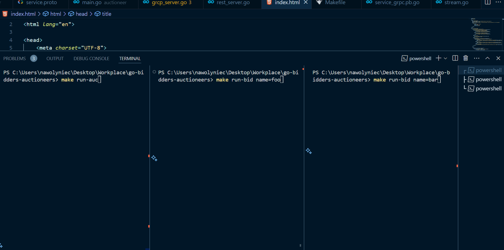

# Betting Simulator

## Overview
The Betting Simulator is a system composed of two main services: **Auctioneer** and **Bidders**. The Auctioneer service receives bets from various bidders, while the Bidders service places intermittent bids. This system is designed to simulate a real-time betting environment.

## Services

### Auctioneer Service
The Auctioneer service handles connections from bidders and processes their bets. It is implemented using gRPC for communication and also offers a RESTful interface for monitoring and managing ads.

#### gRPC Interface
The Auctioneer service has the following gRPC (exposed in port 4000) methods:

```proto
service AdService {
    rpc Connect(UserRequest) returns (UserResponse);
    rpc ListenRequests(UserResponse) returns (stream AdRequest);
    rpc Bid(AdResponse) returns (AdStatus);    
}
```


* Connect: Establishes a connection with a bidder.
* ListenRequests: Streams new ads to the connected bidders.
* Bid: Receives bids from bidders and returns the current status of the bid.

#### REST Interface
The Auctioneer service also exposes a REST API on port 8080 with the following endpoints:

*  **GET /ads/?status=0/1/2/3**: Retrieves the status of Ads (0 created, 1 open, 2 closed, 3 all).
* **GET /ads/winners**: Retrieves the Winners.
* **POST /ads/new**: Creates a new ad.
* **GET /users**: List users.


### Bidder Service
The Bidder service connects to the Auctioneer and places random bids at intervals. The intervals are no more than 2 seconds, and each bidder can place up to 1000 bids, both chosen randomly.

## Visualization
The system includes an index.html file that periodically updates to display the current status of ads and users. It also allows the creation of new ads through a user-friendly interface.

## Getting Started
First build the go services and then run them.
``` bash
make build
```

Run first the Auctioneer service and then the Bidder service. The visualization can be accessed by opening the index.html file in a browser.
``` bash
make run-auct
```

In different terminals run the bidder service with different names.
``` bash
make run-bid name=Homer
```

``` bash
make run-bid name=Liza
```

``` bash
make run-bid name=Bart
```

Open the index.html file in a browser to visualize the system.

## Demo
